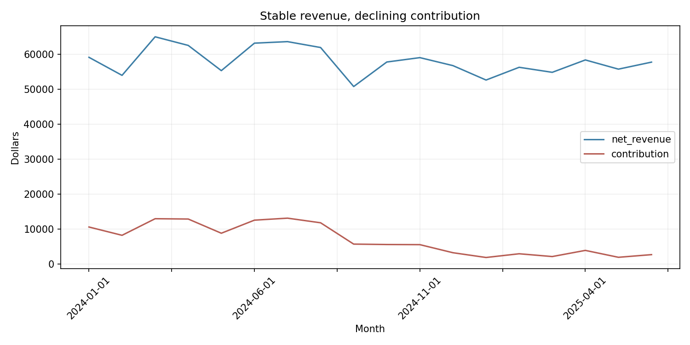

# SQL Investigation Lab

I built this project to show how I use SQL to investigate a business problem, not just retrieve rows. The scenario begins with a practical question: **why is revenue relatively stable while contribution margin is declining?**



## Why I Built This

A dashboard can show that performance changed, but an analyst still has to determine where the change came from. I designed a synthetic multi-location operation with connected sales, product, customer, return, and cost data so I could trace one headline problem through several possible drivers.

## What I Investigated

- Is the decline caused by lower revenue or worsening unit economics?
- Which locations are using the most discounting?
- Are operating costs changing differently by location?
- Which product categories are producing the highest return rates?
- Can each conclusion be traced to a reproducible query?

## How I Designed It

I modeled seven related tables and enforced their relationships with primary keys, foreign keys, checks, and indexes. The synthetic generator creates 2,430 orders and 6,145 order lines with three intentional signals: rising Coastal Hub discounting, increasing South Hub operating costs, and elevated Recovery-category returns.

The investigation uses joins, common table expressions, conditional calculations, aggregation, and the `RANK()` window function. I keep data generation, database construction, SQL, and reporting separate so the work is easy to audit and rerun.

## Project Structure

```text
sql-investigation-lab/
├── data/                       # Synthetic source tables and provenance
├── outputs/generated/          # Query results and chart
├── scripts/                    # Data, database, and report workflow
├── sql/
│   ├── 01_schema.sql           # Tables, constraints, and indexes
│   └── 02_investigation.sql    # Three staged business investigations
├── tests/                      # Integrity and query execution checks
├── README.md
└── requirements.txt
```

## What I Found

- Monthly net revenue remains mostly between roughly **$51K and $65K**.
- Contribution margin falls from approximately **15–21%** early in the period to approximately **3–7%** late in the period.
- Coastal Hub becomes the leading discount location after the ninth month.
- Recovery products have the highest return rate at approximately **5%**.
- The largest cost shift is concentrated at South Hub rather than spread evenly across the business.

My conclusion is that the problem is not explained by sales volume alone. Margin pressure comes from the combination of heavier discounting, a location-specific cost increase, and a product-category return problem.

## How to Run

```bash
python3 -m venv .venv
source .venv/bin/activate
python -m pip install -r requirements.txt
python scripts/generate_data.py
python scripts/build_database.py
python scripts/run_investigation.py
```

Run the validation suite:

```bash
python -m unittest discover -s tests -v
```

## Validation

I validate the database with foreign-key checks and expected row counts. The test suite also executes every investigation query against a newly generated database. The data generator uses a fixed seed, so the results are reproducible.

## Limitations

- The dataset is synthetic and intentionally contains discoverable patterns.
- SQLite is appropriate for a portable portfolio project but does not represent a production warehouse.
- Operating costs are monthly and location-level, so they cannot support order-level causal claims.
- The findings identify where to investigate; they do not prove why customer or operational behavior changed.

